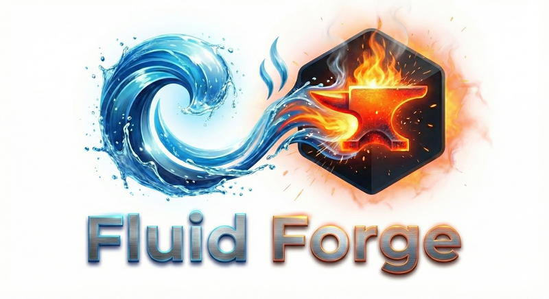

<div align="center">



<br><br>

### Stop writing boilerplate. Start declaring Data Products.

**The declarative control plane for data engineering in the Agentic Era.**

[](https://python.org)
[](LICENSE)
[](https://pypi.org/project/fluid-forge/)

[Documentation](https://fluidhq.io/docs) · [Quickstart](#-60-seconds-to-magic) · [Community](https://github.com/Agentics-Rising/forge-cli/discussions) · [Enterprise](https://fluidhq.io)

</div>

---

## ⚡ 60 Seconds to Magic

Data engineering shouldn't require weeks of handwritten infrastructure code, bespoke CI/CD pipelines, and copy-pasted SQL.

**What Terraform did for infrastructure, FLUID Forge does for data products.**

```bash
# 1. Install
pip install fluid-forge

# 2. Validate your data product contract
fluid validate contract.fluid.yaml

# 3. See exactly what will happen
fluid plan contract.fluid.yaml

# 4. Deploy infrastructure, logic, and governance — instantly
fluid apply contract.fluid.yaml
```

That's it. You just deployed a **versioned, governed, and orchestrated Data Product** from a single YAML file.

> **Want to move from local to Google Cloud?**
> `pip install "fluid-forge[gcp]"` → change `platform: local` to `platform: gcp` → run `fluid apply`. Done.

**From source:**
```bash
git clone https://github.com/Agentics-Rising/forge-cli.git
cd forge-cli
pip install -e ".[local]"
fluid validate examples/01-hello-world/contract.fluid.yaml
```

---

## 🤯 Why We Built This

Data engineering is stuck in the dark ages of imperative spaghetti code. You want to ship data products fast, but compliance teams demand governance. You end up with **Configuration Sprawl**: `.tf` files for Terraform, `schema.yml` for dbt, `.rego` for OPA, and a web of Airflow DAGs.

**FLUID Forge is the compiler that ends the chaos.** You declare what your data product *is*. The CLI compiles that into a validated, deterministic execution plan across any supported cloud.

### The Old Way vs. The FLUID Way

| 🛑 **The Old Way** (Imperative Chaos) | ✨ **The FLUID Way** (Declarative Order) |
|----------------------------------------|------------------------------------------|
| Weeks of boilerplate to wire up IaC, SQL, and DAGs | **Minutes** to deploy. Declare your intent and apply. |
| Vendor lock-in. Your DAGs only work on one cloud. | **Provider-agnostic.** Switch clouds by changing one line of YAML. |
| Governance as an afterthought. Manual compliance tickets. | **Governance-as-Code.** Policies compile to native IAM before deployment. |
| "Works on my machine." Broken production deploys. | **Deterministic plans.** See exactly what will change before it runs. |
| AI hallucinations. Agents don't understand your tables. | **Semantic Truth.** Built-in semantics so LLMs query perfectly. |

---

## 🧬 Anatomy of a FLUID Contract

Everything starts with `contract.fluid.yaml` — the **single source of truth** for your data product's entire lifecycle.

```yaml
fluidVersion: "0.7.1"
kind: DataProduct
id: example.customer_360
name: Customer 360
domain: analytics

metadata:
  layer: Gold
  owner:
    team: data-platform
    email: platform@example.com

# 1. THE LOGIC — How is it built?
builds:
  - id: transform_customer
    pattern: embedded-logic
    engine: sql
    properties:
      sql: |
        SELECT user_id, email, LTV
        FROM raw.users JOIN raw.orders USING (user_id)

# 2. THE INTERFACE — What does it output?
exposes:
  - exposeId: customer_profiles
    kind: table
    binding:
      platform: snowflake              # ← Change to 'gcp' or 'aws' instantly
      format: snowflake_table
      location:
        database: PROD
        schema: GOLD
        table: CUST_360
    contract:
      schema:
        - name: email
          type: string
          sensitivity: pii             # ← Triggers auto-masking/encryption

# 3. THE GOVERNANCE — Who (or what) can access it?
accessPolicy:
  grants:
    - principal: "group:marketing@example.com"
      permissions: ["read"]

agentPolicy:                           # ← Agentic Era Governance
  allowedModels: ["gpt-4", "claude-3"]
  allowedUseCases: ["analysis", "summarization"]
```

Every section of the contract:

| Section | Purpose |
|---------|---------|
| **metadata** | Ownership, domain, data layer (Bronze / Silver / Gold), tags |
| **builds** | Transformation steps — SQL, Python, dbt — with dependency ordering |
| **exposes** | Output artifacts — tables, views, files — with schema contracts |
| **ingest** | Data source definitions with format, location, and freshness SLAs |
| **dataQuality** | Validation rules (not-null, uniqueness, range, custom SQL) |
| **accessPolicy** | RBAC grants compiled to provider-native IAM |
| **observability** | Alerting, SLA monitoring, lineage metadata |
| **agentPolicy** | Governance rules for AI/LLM access to this data product |

---

## 🔌 Providers — Bring Your Own Cloud

Providers are the bridge between your declarative contract and your target execution environment.

| Provider | Target Ecosystem | Superpowers |
|----------|-----------------|-------------|
| 💻 **local** | DuckDB, Local FS | Zero-config. Runs anywhere. Perfect for dev/test. |
| ☁️ **gcp** | Google Cloud | BigQuery, GCS, Composer (Airflow), Dataform, IAM. |
| 🌩️ **aws** | Amazon Web Services | S3, Glue, Athena, Redshift, MWAA, IAM. |
| ❄️ **snowflake** | Snowflake | Databases, schemas, streams, tasks, RBAC, sharing. |

Export-only providers for open data standards: **odps**, **odcs**, **datamesh-manager**.

---

## 🛠️ Installation

FLUID Forge is modular. Install only what you need.

```bash
pip install fluid-forge                # Minimal — CLI + Local/DuckDB provider
pip install "fluid-forge[gcp]"         # + Google Cloud
pip install "fluid-forge[aws]"         # + AWS
pip install "fluid-forge[snowflake]"   # + Snowflake
pip install "fluid-forge[all]"         # Everything
```

> 💡 **Tip:** We recommend [pipx](https://pipx.pypa.io/) for an isolated global install:
> `pipx install "fluid-forge[all]"`

### From Source (Contributors)

```bash
git clone https://github.com/Agentics-Rising/forge-cli.git
cd forge-cli
pip install -e ".[local]"    # Quick — just the CLI + DuckDB
# or
make setup                   # Full dev environment: venv, all extras, tests, doctor
```

---

## 💻 CLI Command Reference

FLUID Forge is designed to feel as natural as `git` or `terraform`.

### Core Lifecycle

```bash
fluid init                           # Scaffold a new Data Product contract
fluid validate contract.fluid.yaml   # Validate schema, dependencies, syntax
fluid plan contract.fluid.yaml       # Generate a deterministic execution plan
fluid apply contract.fluid.yaml      # Execute the plan against your target provider
fluid verify contract.fluid.yaml     # Post-deployment data quality & compliance checks
```

### AI & Code Generation

```bash
fluid forge                                  # 🤖 Interactive, AI-powered project creation
fluid generate-airflow contract.fluid.yaml   # Compile contract → native Airflow DAG
fluid generate-pipeline contract.fluid.yaml  # Scaffold transformation code
fluid scaffold-ci contract.fluid.yaml        # Generate CI/CD configs
```

### Governance & Compliance

```bash
fluid policy-compile contract.fluid.yaml   # Translate policies → native IAM
fluid policy-check contract.fluid.yaml     # Check policy compliance
fluid contract-tests contract.fluid.yaml   # Run assertion suites
```

### Visualization & Exploration

```bash
fluid graph contract.fluid.yaml     # Graphviz DAG of internal lineage
fluid docs contract.fluid.yaml      # Auto-generate documentation from contract
fluid diff old.yaml new.yaml        # Diff between contract versions
```

### System

```bash
fluid doctor     # Diagnostics and feature checks
fluid providers  # List registered providers and capabilities
fluid version    # Version and build info
```

---

## 🎓 Templates

Don't start from scratch. `fluid init` ships with battle-tested enterprise patterns:

```bash
fluid init --template customer-360
```

| Template | What You Get |
|----------|-------------|
| `hello-world` | The basics — start here |
| `csv-basics` | CSV ingestion and transformation |
| `customer-360` | Multi-source customer analytics |
| `incremental-processing` | Append/merge load patterns |
| `multi-source` | Complex DAG dependency orchestration |
| `data-quality-validation` | Quality rule patterns |
| `external-sql-files` | Reference external `.sql` files |
| `pipeline-orchestration` | Orchestration patterns |
| `policy-examples` | Advanced RBAC and AI agent governance |

---

## 🏛️ Governance & Agent Policy

FLUID contracts embed governance declarations that compile to provider-native enforcement.

```yaml
# Access Policy — compiles to BigQuery IAM / Snowflake GRANTs / AWS IAM
accessPolicy:
  classification: confidential
  grants:
    - role: viewer
      principals: ["group:analysts@company.com"]

# Agent Policy — governs how AI/LLM systems access this data
agentPolicy:
  allowedModels: ["gpt-4", "claude-3"]
  allowedUseCases: ["summarization", "anomaly-detection"]
  dataRetention: "none"
  humanInLoop: true

# Data Sovereignty — enforced at plan time
sovereignty:
  jurisdiction: EU
  residency: strict
  allowedRegions: ["europe-west1", "europe-west3"]
```

See [AGENTS.md](AGENTS.md) for the full AI agent integration guide.

---

## 🧑‍💻 Development

```bash
make setup          # Full setup: venv + all extras + doctor
make test           # Run test suite
make lint           # Ruff + mypy
make fmt            # Auto-format (Black)
make build          # Build wheel
make clean          # Remove build artifacts
make doctor         # Run diagnostics
make demo           # Run validate → plan → apply on example
```

### Project Structure

```
forge-cli/
├── fluid_build/              # Python package (the CLI)
│   ├── cli/                  # Command implementations
│   ├── providers/            # Provider plugins (local, gcp, aws, snowflake, ...)
│   ├── forge/                # AI-assisted project creation engine
│   ├── policy/               # Policy compiler, agent policy, sovereignty
│   ├── blueprints/           # Enterprise blueprint registry
│   ├── schemas/              # FLUID JSON Schema versions
│   └── templates/            # Init templates
├── tests/                    # Pytest suite
├── examples/                 # Progressive learning examples
├── pyproject.toml            # Package metadata and dependencies
├── Makefile                  # Developer ergonomics
├── AGENTS.md                 # AI agent integration guide
├── LICENSE                   # Apache 2.0
└── NOTICE                    # Attribution
```

---

## 🤝 Contributing

FLUID Forge is community-driven. We want your ideas, providers, and pull requests.

1. Fork the repo
2. Run `make setup` for a full dev environment
3. Create a feature branch (`git checkout -b feature/my-feature`)
4. Make your changes and add tests
5. `make lint && make test`
6. Submit a pull request

See [CONTRIBUTING.md](CONTRIBUTING.md) for style guides and architecture overview.

---

## License

[Apache License 2.0](LICENSE) · Copyright 2024–2026 Agentics Transformation Pty Ltd

---

<div align="center">

**Built for the future of data. Built for the Agentic Era.**

[fluidhq.io](https://fluidhq.io) · [Documentation](https://fluidhq.io/docs) · [PyPI](https://pypi.org/project/fluid-forge/) · [Issues](https://github.com/Agentics-Rising/forge-cli/issues)

</div>
